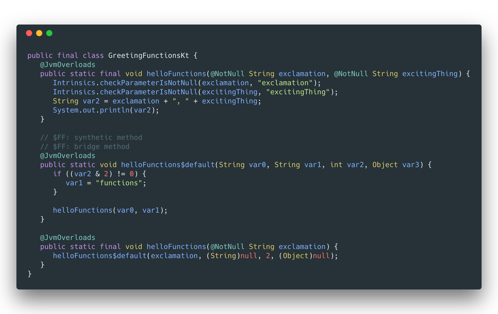
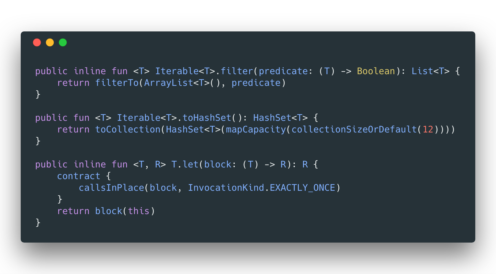
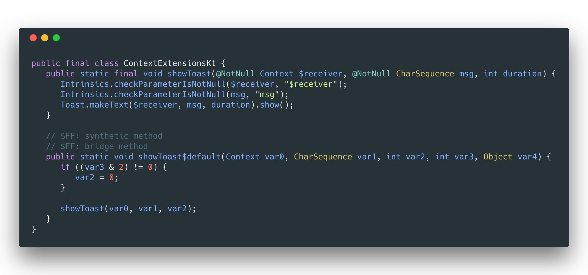

footer: @n8ebel #androidsummit
build-lists: true
slidenumbers: true

[.hide-footer]
[.slidenumbers: false]

#[fit] fun() Talk

## Exploring Kotlin Functions

### @n8ebel

^ At this point, I think it's safe to say most everybody here has at least heard of Kotlin

^ If not, no worries.  I'm not going to make you raise your hand
^ However, I encourage you to check it out
^ And hopefully this will spark your curiosity
___

> ♥️ == Kotlin + Functions

___

# ♥️ == Kotlin + Functions

- Free functions
- Higher-order functions
- Rich `stdlib`

^ functions aren't strictly tied to a class or object
___

# ♥️ == Kotlin + Functions

^ many useful functions in the stdlib

- `arrayOf()`, `listOf()`
- `measureTimeMillis { doSomething() }`
- `orEmpty()`
- `forEach()`, `groupBy()`

___

# Let's Have Some fun()
Functions in Kotlin:
- Easy to get started
- Flexible & Convenient
- Enable Freedom to Reimagine

^ We're going to explore function's from their basics variants to more complex iterations

___

> Easy to Get Started

___

## Easy to Get Started

^ getting started with Kotlin functions is easy

- Can use the IDE conversion tool
- Can try online (https://try.kotlinlang.org)
- Easy to transfer existing knowledge

^ but much more to discover
___

# [fit] From Java to Kotlin

^ without further ado, let's kick off this dive into Kotlin functions by looking at some Java code 😀

___

# Hello Java Method

^ here we have the Java method that we probably all know
^ whether you love it or hate it is between you and java

```java
class Greeter {
    void helloFunctions() {
        System.out.println("Yay, Functions");
    }
}
```
- return type, name, method body

^ we'll start here so we can build up our mental model of Kotlin functions with a common starting point

___

# Java Method Converted to Kotlin

^ if converted with Android Studio we might get something like this

```Kotlin
class Greeter {
  fun helloFunctions() {
    println("Yay, Functions")
  }
}
```

^ not that different right?
^ but there are a few things to notice

- adds the `fun` keyword
- no explicit return type

^ great.  pretty straightforward. a little more conside version of the familiar java method

___

# Further Simplification

^ for this simple case, we can simplify this function even more

```kotlin
class Greeter {
  fun helloFunctions() = println("Yay, Functions")
}
```

^ can omit the braces all-together
^ this form is known as a single-expression function
^ we'll look a bit closer at how this works in a bit
___

# Further Simplification

^ and if the function doesn't need to be associated with an object, we can make it a top-level, free function

```Kotlin
fun helloFunctions() = println("Yay, Functions")
```
___

> Flexible & Convenient

^ so what's left?
^ thankfully or this would be an awkwardly short talk
^ let's build on our example to explore how you can interact with a function
___

## Flexible & Convenient

^ the features of Kotlin functions make them flexible and convenient

- Parameter & type flexibility
- Variations in scoping
- Variety of modifiers

^ we'll explore a variety of ways that these make our lives easier as developers

___

# Parameter & Type Freedom

- Default parameters
- Named arguments
- Variable arguments
- Inferred return types
- Generic functions

^ let's start by looking at parameter basics

___

# [fit] Default Parameters

___

# Parameter Basics

^ if we couldn't have parameters, functions would be pretty boring
^ parameters are defined using <name> colon <type>

```Kotlin
fun helloFunctions(excitingThing:String) {
  println("Yay, " + excitingThing)
}

helloFunctions("functions")
// outputs "Yay, functions"
```

___

# Parameter Basics

^ of course we can have multiple parameters as well
^ multiple parameters are separated by commas

```Kotlin
fun helloFunctions(exclamation:String, excitingThing:String) {
  println(exclamation + ", " + excitingThing)
}

helloFunctions("Yay", "functions")
// outputs "Yay, functions"
```
___

# Default Parameters

```Kotlin
fun helloFunctions(exclamation:String, excitingThing:String = "functions") {
  println(exclamation + ", " + excitingThing)
}

// outputs "Yay, functions"
helloFunctions("Yay", "functions")

// outputs "Yay, functions"
helloFunctions("Yay")
```
___

# Default Parameters

- function parameters can have default values
- when an argument is omitted, the default value is used

___

# Default Parameters

- allows us the flexibility of overloads without the verbosity of writing them
- help document the function contract by indicating what "sensible defaults" might be

___

# Default Parameters & Java

- Java doesn't have default parameter values
- Must specify all parameter values when calling from Java

___

# Default Parameters & Java

```Java
public class Main {
    // compiles
    GreetingFunctionsKt.helloFunctions("Yay", "functions");

    // does not compile
    GreetingFunctionsKt.helloFunctions("Yay");
}
```
___

# Default Parameters & Java

- can use __@JvmOverloads__ to generate overloads for each parameter
- generated overloads will use the specified default values

___

# Default Parameters & @JvmOverloads

```Kotlin
@JvmOverloads
fun helloFunctions(exclamation:String, excitingThing:String = "functions") {
  println(exclamation + ", " + excitingThing)
}
```

___



___

# Default Parameters & @JvmOverloads
With the generated Java methods now available, both Java invocations now compile

```Java
public class Main {
    GreetingFunctionsKt.helloFunctions("Yay", "functions");
    GreetingFunctionsKt.helloFunctions("Yay");
}
```

___

# [fit] Named Arguments

___

# Named Arguments

^ examine the source/documentation?

```Kotlin
helloFunctions("functions", "functions")
```

- How do we know which value is correct?

___

# Named Arguments

```Kotlin
helloFunctions(exclamation = "yay!", excitingThing = "functions")
```
- Much easier to understand with named arguments

___

# Named Arguments

^ looking at our example, notice the names of the parameters

- Improve readability of function invocations
- Modify order of passed parameters by using named arguments
- Refactor parameter count/order without breaking code

___

# Named Arguments

```Kotlin
fun helloFunctions(exclamation:String, excitingThing:String = "functions") {
  println(exclamation + ", " + excitingThing)
}
```

```Kotlin
helloFunctions("Hooray", "functions")
helloFunctions("Hooray")
helloFunctions(excitingThing = "functions", exclamation = "Hooray")
// all output "Hooray, functions"
```
^ notice we've reversed the order in which these are passed
^ by providing the name, the correct behavior is achieved

^ This allows for a reduced number of overloads compared to other languages:

___

# Named Argument Limitations

There are limitations to how named & positioned arguments are used
- once an argument name is specified, all subsequent arguments must be named as well

___

# Named Argument Limitations

^ this example works fine

```Kotlin
helloFunctions("hooray", "Android Summit")
helloFunctions("hooray", excitingThing = "Android Summit")
// both output "hooray, Android Summit"
```

^ this example fails to compile

```Kotlin
helloFunctions(excitingThing = "Android Summit", "hooray")
// error: Mixing named and positioned arguments not allowed
```
___

# Named Arguments & Java

- Named arguments are not supported from Java
- Arguments must be passed in the order they are defined

___

# [fit] Variable Arguments

___

# Variable Number of Arguments

^ like in Java

We can define a parameter to accept a variable number of arguments `T`
- use the __vararg__ keyword
- the __vararg__ param is then treated as an array of type T
- default value must now be an array
___

# Variable Number of Arguments

^ imagine we want to print multiple exciting things
^ can mark the 2nd param with `vararg` to accept multiple inputs

```Kotlin
fun helloFunctions(exclamation:String, vararg excitingThings:String) {
  for(excitingThing in excitingThings) {
    println(exclamation + ", " + excitingThing)
  }
}

helloFunctions("yay!", "Android Summit", "Kotlin", "Android")
// outputs:
// yay!, Android Summit
// yay!, Kotlin
// yay!, Android
```
^ excitingThings is treated as an array or strings, so it can be iterated over

___

# Variable Number of Arguments

Typically, a __vararg__ parameter will be the last one

Can be used in any order if:
- other parameters are called using named argument syntax
- last parameter is a function passed outside the parentheses

___

# Variable Number of Arguments

This works great

```Kotlin
helloFunctions("yay!", "Android Summit", "Kotlin", "Android")
helloFunctions("Android Summit", "Kotlin", "Android", exclamation = "yay!")

// both output:
// yay!, Android Summit
// yay!, Kotlin
// yay!, Android
```

___

# Variable Number of Arguments

This works

^ but because no named arguments are used, the first item becomes the exclamation

```Kotlin
helloFunctions("Android Summit",  "Kotlin", "Android")
// output:
// "Android Summit, Kotlin"
// "Android Summit, Android"

```

___

# Variable Number of Arguments

This won't compile

```Kotlin
helloFunctions("Android Summit", exclamation = "yay!", "Kotlin", "Android")
// error: "no matching function"
```

^ can't find a match because of the missing of argument types

___


# Variable Number of Arguments

Use "spread" operator to pass an existing array of values

```Kotlin
val thingsToBeExcitedAbout = arrayOf("Android Summit", "Kotlin", "Android")
helloFunctions("yay!", *thingsToBeExcitedAbout)

// output:
// yay!, Android Summit
// yay!, Kotlin
// yay!, Android
```

---

# Variable Number of Arguments

```Kotlin
helloFunctions("yay!", "coffee", *thingsToBeExcitedAbout)
helloFunctions("yay!", *thingsToBeExcitedAbout, "coffee")
```
- "Spreading" can be used alone, or with other passed varargs as well
- input array to the vararg parameter is handled in order

^ in first call here coffee will be first, and in the 2nd call it will be last

___

# [fit] Return Types

___

# Return Types

What is the return type?

```Kotlin
fun helloFunctions(exclamation:String, excitingThing:String="functions") {
  println(exclamation + ", " + excitingThing)
}
```
- If a function does not return any useful value, its return type is Unit

___

# Return Types

These are equivalent

```Kotlin
fun helloFunctions(exclamation:String, excitingThing:String="functions") : Unit {
  println(exclamation + ", " + excitingThing)
}

fun helloFunctions(exclamation:String, excitingThing:String="functions") {
  println(exclamation + ", " + excitingThing)
}
```
___

# Return Types: Non-Unit Type

Functions with a block body require explicit return type & call for non-Unit functions

```Kotlin
fun helloFunctions(exclamation:String, excitingThing:String="functions") : String {
  return exclamation + ", " + excitingThing
}
```
___

# Return Types: Non-Unit Type

Can infer return type for single-expression functions

```Kotlin
fun helloFunctions(exclamation:String, excitingThing:String="functions")
    = exclamation + ", " + excitingThing
```
___

# [fit] Generic Functions

___

# Generic Functions

- Like classes, functions may have generic type parameters
- many stdlib functions are built with generics

___



___

# [fit] Variations In Scope

___

# Variations In Scope

- Top-level
- Member functions
- Local
- CompanionObject
- Extension functions

___

# [fit] Top-Level functions

___

# Top-Level functions

- Not associated with a class or object
- Defined within a Kotlin file
- Belong to their declared file's package
- Import to use within other packages

^ enable interesting changes in how we build our apps

___

# Top-Level Function Patterns
- Replace stateless classes filled with static methods
- Swap your "Util" or "Helper" classes with functions

^ great for functionality that is widely used
^ ex: threading helpers, loggers
^ possibly even fewer classes/objects to be dependent on

___

# Top-Level Function Considerations

- Not truly removing classes
- Generated as a public static method on a class using a special convention
- __<function's file name>Kt.java__

___

# Top-Level Function Considerations

```Kotlin
// inside Logging.kt

package logging

fun log(error:Throwable) {...}
```
___

# Top-Level Function Considerations

```Kotlin
// call from Kotlin
log(Throwable("oops"))
```

___

# Top-Level Function Considerations

__Generated Code__
<br>

```Java
public class LoggingKt {
  public static void log(Throwable error) {...}
}
```
___

# Top-Level Function Considerations

```Java
// call from Java
LoggingKt.log(new Throwable("oops"))
```

^ notice the name of the generated class

___

# Top-Level Function Considerations

Can override the generated class/file name

- Add __@file:JvmName(<desired class name>)__ to function's file
- Must be before the declared package

___

# Top-Level Function Considerations

```Kotlin
// inside Logging.kt

@file:JvmName("LoggingFunctions")
package logging

fun log(error:Throwable) {...}
```

___

# Top-Level Function Considerations

```Java
// call from Java
LoggingFunctions.log(new Throwable("oops"))
```
___

# [fit] Member Functions

___

# Member Functions

- Function associated with a class or object
- Have access to private members of the class or object

^ Like a Java method
^ can be referred to as a "method" because of the association with an object

___

# Member Functions

```Kotlin
class Speaker() {
    fun giveTalk() { ... }
}

// create instance of class Speaker and call giveTalk()
Speaker().giveTalk()
```

___

# Member Function Considerations

- Default arguments can't be changed in overridden methods
- If overriding a method, you must omit the default values

___

# Local Functions

___

# Local Functions

Functions inside of functions

- Create a function that is scoped to another function
- Useful if your function is only ever called from another function

___

# Local Functions

- Declare like any other function, but within an existing function
- Have access to all params and variables of the enclosing function

___

# Local Functions

```Kotlin
fun outerFunction(name:String) {
  fun innerFunction() {
    println(name)
  }
  ...
  innerFunction() // will print the passed name
}
```

___

# Local Functions

Why would you want this?

- Clean code
- Avoids code duplication
- Avoid deep chains of function calls

___

# Local Functions

```Kotlin
fun parseAccount(response:AccountResponse) : Account {
  ...

  val hobbies = response.getField("hobbies").map{
    val key = it.getField("key")
    Hobby(key)
  }

  val favoriteFoods = response.getField("favorite_foods").map{
    val key = it.getField("key")
    Food(key)
  }
}
```

___

# Local Functions

```Kotlin
fun parseAccount(response:AccountResponse) : Account {
  fun parseKey(entity:ResponseEntity) = entity.getField("key")

  ...

  val hobbies = response.getField("hobbies").map{
    val key = parseKey(it)
    Hobby(key)
  }

  val favoriteFoods = response.getField("favorite_foods").map{
    val key = parseKey(it)
    Food(key)
  }
}
```

___

# Local Function Considerations

- Local function or private method?
- Is the logic going to be needed outside the current function?
- Does the logic need to be tested in isolation?
- Is the enclosing function still readable?

___

# [fit] Companion Objects

___

# Companion Objects

^ if you're not familiar, a companion object is essentially a singleton inside an enclosing class

^ just in case: a companion object is initialized when the corresponding class is loaded (resolved), matching the semantics of a Java static initializer

- No static method/functions in Kotlin
- Recommended to use top-level functions instead
- What if you need access to private members of an object?

___

# Companion Objects

- Want to create a factory method?
- Define a member function on a companion object to gain access to private members/constructors

___

# Companion Objects: Use from Kotlin

```Kotlin
class Course private constructor(val key:String)

// won't work
// can't access the private constructor
fun createCourse(key:String) : Course {
    return Course(key)
}
```

___

# Companion Objects: Use from Kotlin

```Kotlin
class Course private constructor(val key:String) {
    companion object {
        fun createCourse(key:String) : Course {
            return Course(key)
        }
    }
}

```

___

# Companion Objects: Use from Kotlin

```Kotlin
class Course private constructor(val key:String) {
    companion object {
        fun createCourse(key:String) : Course {
            return Course(key)
        }
    }
}

// can then call the factory method
Course.createCourse("somekey")
```

___

# Companion Objects: Use From Java

```Kotlin
class AuthFragment : Fragment() {
  ...
  companion object {
    fun newInstance(username: String) = ...
  }
}
```
___

# Companion Objects: Use From Java
^ Must explicitly reference the `Companion` when calling from Java

```Java
@Override
protected void onCreate(Bundle savedInstanceState) {
    super.onCreate(savedInstanceState);

    // explicitly reference `Companion` from Java
    AuthFragment.Companion.newInstance("username")
}
```
___

# Companion Objects: Renaming

Usage from Java is verbose

```Java
AuthFragment.Companion.newInstance("username")
```

___

# Companion Objects: Renaming

```Kotlin
class AuthFragment : Fragment() {
  ...
  companion object Factory {
    fun newInstance(username: String) = ...
  }
}
```

```Java
AuthFragment.Factory.newInstance("username")
```

___

# Companion Objects: @JvmStatic
^ Add the `@JvmStatic` annotation

^ will generate a true Java static method

```Kotlin
class AuthFragment : Fragment() {
  ...
  companion object {
    @JvmStatic
    fun newInstance(username: String) = ...
  }
}
```
___

# Companion Objects: @JvmStatic

```Java
@Override
protected void onCreate(Bundle savedInstanceState) {
    super.onCreate(savedInstanceState);

    // no need to reference `Companion`
    AuthFragment.newInstance("username")
}
```
___

# [fit] Variations

___

# Variations

- `infix`
- `extension`
- higher-order
- `inline`

___

# [fit] infix Functions

___

# infix Functions

- `infix` keyword enables usage of infix notation
- What is infix notation?
- Can omit the dot & parentheses for a function call

- ```Kotlin
"key" to "value"
```

^ the 'to' function used to return a Pair

___

# infix Functions

- Must be a member function or extension function

^ we will look at extension functions shortly

- Must take a single, non-varargs, parameter with no default value

___

# infix Functions

```Kotlin
class ConferenceAttendee {
    infix fun addInterest(name:String){...}
}

// call the function without dot or parentheses
val attendee = ConferenceAttendee()
attendee addInterest "Kotlin"
```

___

# infix Functions

- Provides a very clean, human-readable syntax
- Core building block of custom DSLs

___

# infix Functions: stdlib

```Kotlin
for (i in 0 until 10 step 2) {
  println(i)  // prints 0,2,4,6,8
}

"key" to someValue // creates a Pair


var result: Boolean
result = true or false // perform logical operations
result = true and false
```
___

# infix Functions: Kotlin Test

```Kotlin
"hello" should haveSubstring("ell")
"hello" shouldNot haveSubstring("olleh")
```

https://github.com/kotlintest/kotlintest

___

# [fit] Extension Functions
___

# Extension Functions

- Extend the functionality of an existing class
- Defined outside the class
- Used as if they were a member of a class

___

# Why Extension Functions?

- Clean-up or extend classes & apis you don't control
- Remove helper classes & simplify top-level functions

___

# Extension Functions

```Kotlin
// add a new function to the View class
fun View.isVisible() = visibility == View.VISIBLE

yourView.isVisible()
```

___

# Extension Functions

```Kotlin
fun showToast(
  context: Context,
  msg:String,
  duration: Int = Toast.LENGTH_SHORT) {

  Toast.makeText(context, msg, duration).show()
}

showToast(context, "Toast!")
```
^ top-level function
^ requires a `Context` always be passed

___

# Extension Functions

```Kotlin
fun Context.showToast(
  msg: CharSequence,
  duration: Int = Toast.LENGTH_SHORT) {

  Toast.makeText(this, msg, duration).show()
}

context.showToast("Toast!")
```
^ extension function
^ `Context` is now the receiver and is called on the context
^ can be defined anywhere

___


# Extension Function Considerations

- How are these generated under the hood?
- How are these called from Java?

___

# Extension Function Considerations

- Generated as static methods that accept the receiver object as it's first argument
- Default behavior is to use __<filename>Kt.<functionName>__

___



___

# Extension Function Considerations

// ContextExtensions.kt

```Kotlin
fun Context.showToast(...) { ... }
```

```Java
// when called from Java
ContextExtensionsKt.showToast(context, "Toast!");
```

___

# Higher-Order Functions
___

# Higher-Order Functions

- Functions that take, or return, other functions
- Can be lambda or function reference
- Many examples in the Kotlin standard library `apply`, `also`, `run`

___

# Higher-Order Functions

- Enable interesting patterns & conventions
- Support functional programming
- Can cleanup setup/teardown patterns such as shared prefs

___

# Higher-Order Functions

```Kotlin
fun getScoreCalculator(level:Level) {
  return when (level) {
    Level.EASY -> { state:ScoreState -> state.score * 10 }
    Level.HARD -> { state:ScoreState -> state.score * 5 * state.accuracy }
  }
}
```

^ can return functions as well
^ could be used as a factory to return strategy functions

___

# Higher-Order Functions

```Kotlin
val predicate = { number:Int -> number > 5 }
listOf(2,4,6,8).filter(predicate)
```

^ we pass the lambda val to the `filter` function on the list
___

# Higher-Order Functions

```Kotlin
fun filterTheList(value:Int) = value > 5
listOf(2,4,6,8).filter(::filterTheList)
```

^ can also pass an existing function

___

# Higher-Order Functions

If the last parameter of a function is a function, you can omit the parentheses
<br>

```Kotlin
listOf(2,4,6,8).filter{ number -> number > 5 }
```

^ in this case, the type of the

___

# Higher-Order Functions

```Kotlin
public inline fun <R> synchronized(lock: Any, block: () -> R): R {
    monitorEnter(lock)
    try {
        return block()
    }
    finally {
        monitorExit(lock)
    }
}

// call from Kotlin
synchronized(database) {
  database.prePopulate()
}
```
___

# Higher-Order Function Performance

__"Using higher-order functions imposes certain runtime penalties"__

- Extra class created when using lambda
- If lambda captures variables, extra object created on each call

^ how to solve?

___

# [fit] inline Functions

___

# inline Functions

- Helps solve higher-order function performance hits
- Body of the inlined function is substituted for invocations of the function

___

# inline Functions

^ example from Kotlin in Action

```Kotlin
inline fun <T> synchronized(lock: Lock, action: () -> T): T {
    lock.lock()
    try {
        return action()
    }
    finally {
        lock.unlock()
    }
}

// call from Kotlin
synchronized(Lock()) {...}
```

___

# inline Functions

```Kotlin
// sample usage
fun inlineExample(l:Lock) {
  println("before")
  synchronized(l) {
    println("action")
  }
  println("after")
}
```

___

# inline Functions

With `inline` the generated code is equivalent to this

```Kotlin
// resulting code
fun inlineExample(l:Lock) {
  println("before")
  lock.lock()
  try {
      println("action")
  }
  finally {
      lock.unlock()
  }
  println("after")
}
```

^ notice how the body of the synchronized function has been written within the body of foo

^ more to be learned regarding the intricacies of `inline`

___

> Android Reimagined

___

## Freedom to Reimagine

> The flexibility & functionality of functions allow us to break away from traditional java conventions and reimagine how we build our projects

^ We're going to explore function's from their basics variants to more complex iterations

___

# Fewer Helper Classes

- `ContextHelper`, `ViewUtils`
- Replace with
    - top-level functions
    - extension functions

___

# Less Boilerplate

```Kotlin
fun doTheThingSafely(theThing:() -> Unit) {
    try {
      theThing()
    } catch(error:Throwable) {
      // handle error
    }
}

doTheThingSafely { unsafeFunction() }
```
___

# Upgrade Our Apis

Can use extensions, default params, etc to cleanup/simplify common apis

- Now seeing community supported examples of this
- Android KTX: https://github.com/android/android-ktx
- Anko: https://github.com/Kotlin/anko

___

# Android KTX

```Kotlin
sharedPreferences.edit()
    .putString("key", "without KTX")
    .putBoolean("isLessBoilerplate", false)
    .apply()

sharedPreferences.edit {
  putString("key", "with KTX")
  putBoolean("isLessBoilerplate", true)
}
```

^ notice we dont have to call edit() or apply() anymore

___

# Android KTX

```Kotlin
// without KTX
supportFragmentManager.beginTransaction()
  .replace(R.id.fragmentContainer, SomeFragment())
  .addToBackStack("name")
  .commit()

// with KTX
supportFragmentManager.transaction {
  replace(R.id.fagmentContainer, SomeFragment())
  addToBackStack("name")
}
```
___

# Cleaner Syntax

```Kotlin
fun log(msg:String) {...}

inline fun runOnBackgroundThread(action:() -> Unit) { ... }
```

- More fluent syntax
- Simplify test mocking
- Avoids extra classes

___

# Useful Collection Functions

- orEmpty()
- arrayOf(), listOf(), mapOf()
- associateBy(), groupBy()
- map(), mapIndexed()
- fold(), reduce(), sum()
- filter(), partition()

___

# Useful Collection Functions

```Kotlin
// easily calculate sum from collection
val totalDownloadSize = downloadRecords.sumBy { it.downloadSize }

// sort all DownloadRecords based on download time
val sortedDownloadEntities = downloadRecords.sortedByDescending { record ->
  record.downloadTime
}
```

___

# Useful Collection Functions

```Kotlin
// return map with all DownloadRecords mapped to their parent enrollmentKey
val entitiesGroupedByEnrollmentKey = downloadRecords.groupBy { record ->
  record.enrollmentKey
}

// ensure we have a non-null collection and map all records to view models
val viewModels = inputRecords.orEmpty().map { record ->
  createViewModel(record)
}
```

___

# Useful String Functions

- isEmpty(), isNotEmpty()
- substringBefore(), substringAfter()
- orEmpty()

___

# Useful String Functions

```Kotlin
if(!url.isNullOrEmpty()) {
  loadData(url)
}


viewModel.body = model.description.orEmpty()
```

___

> Kotlin functions provide flexibility & freedom in how you build your apps

___

# Go, and Have fun()

- Easy to get started with functions
- Flexibility gives convenience
- Enables us to reimagine how we build our apps

___

# Let's Continue the Discussion

```kotlin
with("n8ebel").apply {
  Twitter
  YouTube
  .com
  Medium
  Facebook
  GitHub
}
```
___

# [fit] Thanks For Coming
