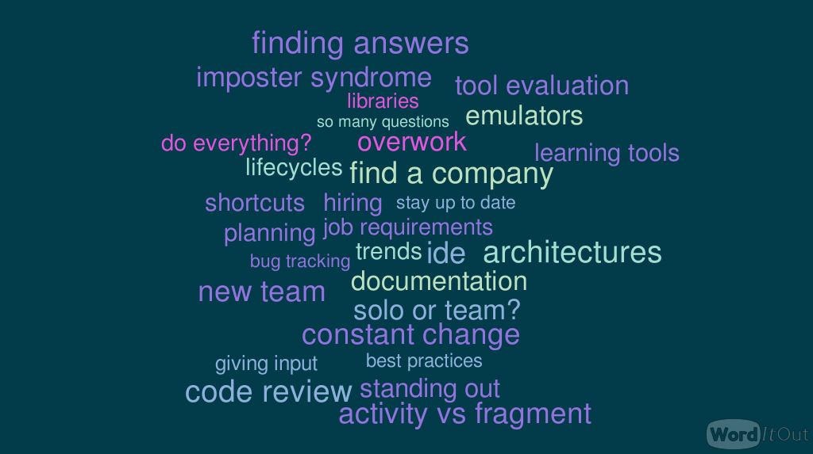

footer: @n8ebel
slidenumbers: true

[.hide-footer]
[.slidenumbers: false]

# __Tips From the Time Machine__
<br>
### __Things I Wish I Had Known When Starting a Career as an Android dev__
<br>
### __@n8ebel__

---

> **_What advice would I give myself?_**

^ but after a lot of great input from the community i felt i needed to update the title
___

### __Things ~~I~~ (We) Wish ~~I~~ (We) Had Known When Starting a Career as an Android dev__

___

> **_What advice would we give ourselves?_**

___

# To the Time Machine

^ let's look a few periods during an early career in androiddev

- Finding your first job
- Growing into your first role
- Building your career

___

> **_Finding Your First Job_**

___

# Finding Your First Job
- What Companies Will You Target?
- Are You Qualified?
- How Will You Stand Out?

___

# What Companies Will You Target?
- Find & focus on your interests
- Look beyond the "Big 4"
- Look for opportunities to learn & grow

___

# Are You Qualified?
- Don't disqualify yourself
- Requirements are often flexible
- There are many ways to highlight yourself

___

# How Will You Stand Out?
- You don't need to do it all
- Experiences outside of Android are still relevant
- Highlight your strengths, whatever those are

___

> **_Growing into your first role_**

___

## **You got the job... everything is good now, right?**

___

# Starting Your First Role
- Where is your desk?
- What is expected of you?
- How does your team build software?
- Where and how are bugs tracked?
- What's a sprint? Isn't scrum for rugby players?
- How do you communicate effectively across an organization?

___

## **So Many Questions**

___

# So many questions

- Having many, many questions is perfectly normal
- That is exactly where you're supposed to be

___

# Are you asking those questions?
- You Probably Should Be

___

# Are you asking those questions?

more pictures can go here
https://twitter.com/orhanobut/status/982970862683832325
https://twitter.com/xnorcode/status/982892026051035136
https://twitter.com/trionkidnapper/status/983103592327536640

___

# Are you asking those questions?

- Remember they already hired you and think you're worth investing in
- Seeking out those answers is a fast track towards growth
- You are enough

___

## **Hitting Your Stride**

___

# Hitting Your Stride
## How can you start to hone your craft?

- How Are Others So Productive?
- How Do Others Always Complete Their Work On Time?
- How Would You Build X?

___

# How Are Others So Productive?
    - ide, emulators, other tools
    - shortcuts
    - architectures/patterns/libraries
    - documentation, source code
    - learning to search properly

^ there are so many useful productivity boosters, but you wont know if you don't ask and explore

^ 3rd party libraries aren't a sign of defeat

^ learning to search effectively is a skill

^ balance the Google

___

# How Do Others Always Complete Their Work On Time?
- They plan for success
- Requirements gathering
- Planning & scoping

^ don't remain uncertain on requirements for the fear of looking silly or uninformed

^ be realistic about what you can take on
^ be assertive in your planning
^ don't bite off more than you can chew

^ if you have leftover time, you can use it to learn

___

## **Things Are Looking Up**

^ for me, these areas of growth were joined with other conerns as well
^ as we step out of our comfort zone, we open ourselves up to greater visibility
___

# Have You Been Faking It This Whole Time?
- why does it take you so long?
- why does your code require so much review?
- how come you're stressed out all the time?

___

> **_Hello Imposter Syndrome_**

___

# Imposter Syndrome

> **_a pervasive pattern of dismissing accomplishments and believing that their success would disappear once others discovered the awful secret that they were, in fact, “impostors.”_** [^1]

[^1]: [https://impostorsyndrome.com/valerie-young/](https://impostorsyndrome.com/valerie-young/)

___


___

# Imposter Syndrome

- It's common
- You're not alone
- Talk about it
- Seek to understand

___

## **Running To Stand Still**

___

# Running To Stand Still
- How come everyone else is using <insert latest trend>?
- Things change fast, how do you stay up to date?
- What should you focus on?

___

# How come everyone else is using <insert latest trend>?

- "everyone" are not, in fact, using all the latest and greatest things
- but they are using some
- and they constantly change

___

# How do you stay up to date?

- Androiddev is always changing: tools, libs, ides, languages, apis, devices
- many places to find useful info
- wont know it all
- learning the basics is both time effective and enables longterm learning

___

# What should you focus on?
- What is relevant at work?
- What are you interested in?
- What keeps you excited?
- What can you explore without sacrificing your personal life?

___

> **_Building Your Career_**

___

# Blazing Your Trail

^ now that you're getting comfortable in your day to day work...

- many paths to build your ideal career
- you don't have to do it all

^ don't overwork (unless that truly makes you the most happy..but it probably doesn't)

___

# What Are Your Goals?
- know yourself. what are your goals?

^ understand your true motivations
^ be honest about yourself and what makes you happy
^ then find ways to incorporate more of that into your life

___

# Maintain Perspective
- your job is not who you are

- don't get too caught up in x vs y
    - fragment vs custom view
    - enums yes or no?

- don't expect yourself to memorize everything
    - apis
    - lifecycles

- critically evaluate anything & everything
    - companies, devs, teams, tools, libs, etc...

___

> **_This Is Hard_**

___

^ Here's a condensed set of challenges from my question to the interwebs



___

## **You Are Not Alone**

___

# You Are Not Alone
we are in this together, but not the same

- the lone wolf goes only so far

- engaging with local and online communities
- build a community within your org
- as you learn from others, you can help others as well
- blogging, sharing, mentoring great way to stay up to date, to learn
- validation and confirmation that everyone struggles

___

> **_So what would I tell myself?_**

^ if i could go back in time, there are so many things i could share with myself.  so many things to be learned and experienced

^ the catch is that you can't learn it all at once.

^ in fact it takes time.  a lot of time.  so much time that we will never know it all

___

# Takeaways

1. Don't tie "lines of code" to happiness

^ or projects, or meetups, or blog posts, etc

2. Everyone feels overwhelmed at times
3. You wont know everything
4. There's no "one size fits all" approach

___

> **_Find what truly makes you happy_**

___

> **_Find what truly makes you happy; follow that where it leads_**

___

> **_Find what truly makes you happy; follow that where it leads; and embrace the journey_**

___

## **Thanks For Sharing**

___

# Thanks For Sharing

Rajanikant Deshmukh → `@_alpharion_`
James Henderson → `@JRayHenny`
Jake Wharton → `@JakeWharton`
Andreas Ioannou → `@xnorcode`
Rhex Gomez → `@rhexgomez`
Jonathan Maltz → `@maltzj`
Jordan Carlyon → `@JordanCarlyon`
Chris → `@kodi`

___

# Thanks For Sharing

Sam Edwards → `@HandstandSam`
Zarah Dominguez → `@zarahjutz`
Chiu-Ki Chan → `@chiuki`
Miquel Beltran → `@Miqubel`
Mike Wolfson → `@mikewolfson`
Adam McNeilly → `@AdamMc331`
Annyce Davis → `@brwngrldev`
Eric Maxwell → `@emmax`
Ryan Harter → `@rharter`

___

# Thanks For Sharing

Giorgio Natili → `@giorgionatili`
Rebecca Franks → `@riggaroo`
Orhan Obut → `@orhanobut`
Anita Singh → `@anitas3791`
Aman → `@multivitaman`
Divya Jain → `@divyajain2405`
Mark O'Sullivan → `@MarkOSullivan94`
Rob Drimmie → `@RobDrimmie`
Kaan Mamikoglu → `@kaanmamikoglu`

___

# Thanks For Sharing

Nnabueze → `@_NezSpencer`
James Coggan → `@mad_team`
Craig Russell → `@trionkidnapper`
Britt Barak → `@BrittBarak`
Anthony → `@AnthonyOng03`
Estefania Cassingena Navone → `@Estefania_Cass`
Bradley Jewell → `@BradleyJewell`
Akshay → `@avdave83` 

___

# Udacity

- Great source of information & training
- Interested in developing Android courses?
- We are hiring!

___

# Thanks For Coming

```kotlin
with("n8ebel").apply {
  Twitter
  .com
  Medium
  Instagram
  Facebook
  GitHub
}
```
