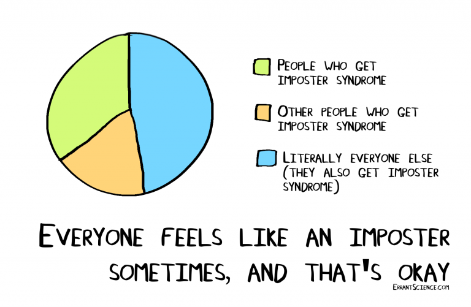
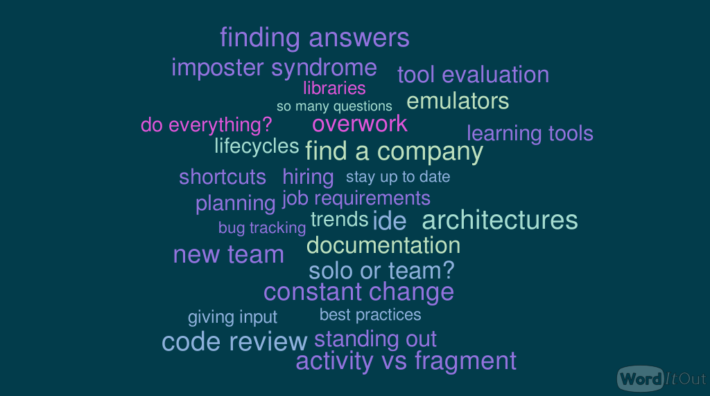

footer: @n8ebel
build-lists: true
slidenumbers: true

[.hide-footer]
[.slidenumbers: false]

# __Tips From the Time Machine__
<br>
### __Things I Wish I Had Known When Starting a Career as an Android dev__
<br>
### __@n8ebel__

---

> **_What advice would I give myself?_**

^ greatest impact on myself & others

___

[.build-lists: false]
# Where's the technical filling?
- How to handle a click?
- Fragments vs Custom views?
- Enums Y or N ?

^ at the time it feels really important

^ and these types of questions are valuable

___

[.build-lists: false]
# Where's the technical filling?
- *Not As Important As It Seems*

^ over the course of a career though, i feel more impact lies elsewhere

^ technical things constantly change

___

# To the Time Machine
- Finding your first job
- Growing into your first role
- Building your career

^ few periods during an early career in androiddev

^ differences... but patterns emerge

___

> **_Finding Your First Job_**

___

# Finding Your First Job
- Define your goals
- What is your ideal self?  Your hobbies?  Your interests?
- *Don't chase a resume checkmark*

^ goals

^ ideal self

^ dont chase

___

# Finding Your First Job
- Honestly evaluate companies and whether they serve in reaching those goals
- Know why you are interviewing at a company
- *Something beyond "it's a job" is preferable*

^ honestly evaluate

^ why this company?
___

# Finding Your First Job
- Don't disqualify yourself
- Requirements are flexible
- Experience comes in many forms
- Highlight what you have

^ dont disqualify

^ flexible requirements

^ show yourself a little compassion

^ don't discount your experience

^ have the courage to show exactly who you are and why you are a great fit
___

> **_Starting Your First Job_**

___
[.build-lists: false]

# Starting Your First Job
- Where is your desk?
- What is expected of you?
- Where and how are bugs tracked?
- What's a sprint? What's a scrum?
- Where's the code?  How is it structured?
- Where is the coffee machine?

___

## **So Many Questions**

___

# So many questions

- How do you feel about those questions?
- Are you comfortable with "I don't know"?

^ how do you feel about those?

^ embarassed?

^ i don't know ?

___

# So many questions
- Having many, many questions is perfectly normal
- That is exactly where you're supposed to be
- You don't have to know everything
- Be open & honest about what you do know

^ embrace your imperfections

^ nobody else knows it all
___

> **_Do you want to learn? or do you want to never be wrong?_**

___

# Why ask?

- Learn faster
- Greater productivity
- Develops trust & confidence

^ ask question receive knowledge

^ Discover tools, shortcuts, patterns, libraries

^ i didn't know about intelliJ

^ i didn't know about genymotion

^ planning to build trust

___

[.build-lists: false]
# Shouldn't You Know These Things?
- They already hired you.  
- You have the skills and are worth investing in
- Open and honest curiosity/learning is the best way to develop that investment

^ remember these things

^ you are enough

___

> **_Imposter Syndrome_**

___

# Imposter Syndrome

> **_a pervasive pattern of dismissing accomplishments and believing that their success would disappear once others discovered the awful secret that they were, in fact, “impostors.”_** [^2]

[^2]: [https://impostorsyndrome.com/valerie-young/](https://impostorsyndrome.com/valerie-young/)

___



___

# Imposter Syndrome

- You're not alone
- Seek to understand
- Talk about it

^ compassion, courage, connection
^ learning to recognize and mitigate this will free you to more fully explore your career paths

___

> **_Building Your Career_**

___

# How do you stay up to date?
- Embrace the change
- You won't know it all

^ embrace change

^ wont know all

___


[.build-lists: false]
# What should you focus on?
- What is relevant at work?
- What are you interested in?
- What keeps you excited?
- What can you explore without sacrificing your personal life?

___

# Maintain perspective
- Don't let trivial things wear you down
- Remember that no one is doing "all the things"

^ api arguments, etc

- Don't sacrifice your personal life
- Be aware of how you impact those around you

___

# Dream Big
- Understand your motivations
- What do you want it to look like?
- Take meaningful steps towards that vision
- No single blueprint

^ this will help you understand your insecurities, doubts, fears, and why they are often not as scary as we first think

^ compassion and courage to dream big

___

> **_This Is Hard_**

___

^ Here's a condensed set of challenges from my question to the interwebs



___

## **You Are Not Alone**

^ this is the secret sauce
___

# You Are Not Alone

- There is an entire community of individuals experiencing the same things
- Engaging with that community is incredibly rewarding
- It doesn't just happen

^ Connection may require several things

^ courage
^ compassion

^ you can open twitter, go to the meetup, etc

^ but if you don't accept yourself you won't be able to form those connections

^ a single tweet used to take me 10 minutes...

___

> **_So what would I tell myself?_**

^ so many things to be learned and experienced

^ the catch is that you can't learn it all at once.

^ it takes time.  a lot of time.  so much time that we will never know it all

___

# So what would I tell myself?

- be curious. ask questions. step out of your comfort zone.
- you are enough. give yourself a break. your work is not you.
- seek and build connections with those around you.  develop a support system.

^ honesty
^ courage
^ compassion
^ connection

^ devlop these things

^ leave behind the fear, the self doubt, the feeling that you aren't enough
___

 > **_It's hard to have an impact when burnt out, alone, and afraid_**

___

# Thanks For Sharing

Rajanikant Deshmukh → `@_alpharion_`
James Henderson → `@JRayHenny`
Jake Wharton → `@JakeWharton`
Andreas Ioannou → `@xnorcode`
Rhex Gomez → `@rhexgomez`
Jonathan Maltz → `@maltzj`
Jordan Carlyon → `@JordanCarlyon`
Chris → `@kodi`

___

# Thanks For Sharing

Sam Edwards → `@HandstandSam`
Zarah Dominguez → `@zarahjutz`
Chiu-Ki Chan → `@chiuki`
Miquel Beltran → `@Miqubel`
Mike Wolfson → `@mikewolfson`
Adam McNeilly → `@AdamMc331`
Annyce Davis → `@brwngrldev`
Eric Maxwell → `@emmax`
Ryan Harter → `@rharter`

___

# Thanks For Sharing

Giorgio Natili → `@giorgionatili`
Rebecca Franks → `@riggaroo`
Orhan Obut → `@orhanobut`
Anita Singh → `@anitas3791`
Aman → `@multivitaman`
Divya Jain → `@divyajain2405`
Mark O'Sullivan → `@MarkOSullivan94`
Rob Drimmie → `@RobDrimmie`
Kaan Mamikoglu → `@kaanmamikoglu`

___

# Thanks For Sharing

Nnabueze → `@_NezSpencer`
James Coggan → `@mad_team`
Craig Russell → `@trionkidnapper`
Britt Barak → `@BrittBarak`
Anthony → `@AnthonyOng03`
Estefania Cassingena Navone → `@Estefania_Cass`
Bradley Jewell → `@BradleyJewell`
Akshay → `@avdave83`

___

# Udacity

- Great source of information & training
- Interested in developing Android courses?
- We are hiring!

___

# Thanks For Coming

```kotlin
with("n8ebel").apply {
  Twitter
  .com
  Medium
  Instagram
  Facebook
  GitHub
}
```
