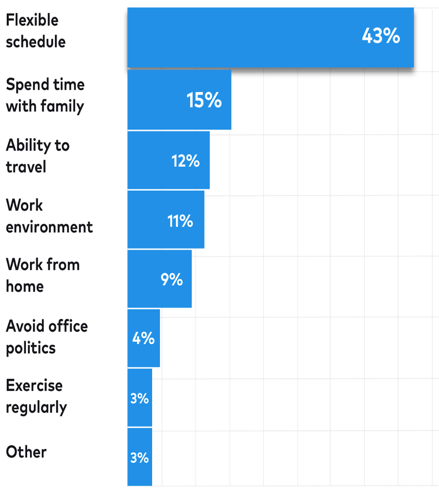
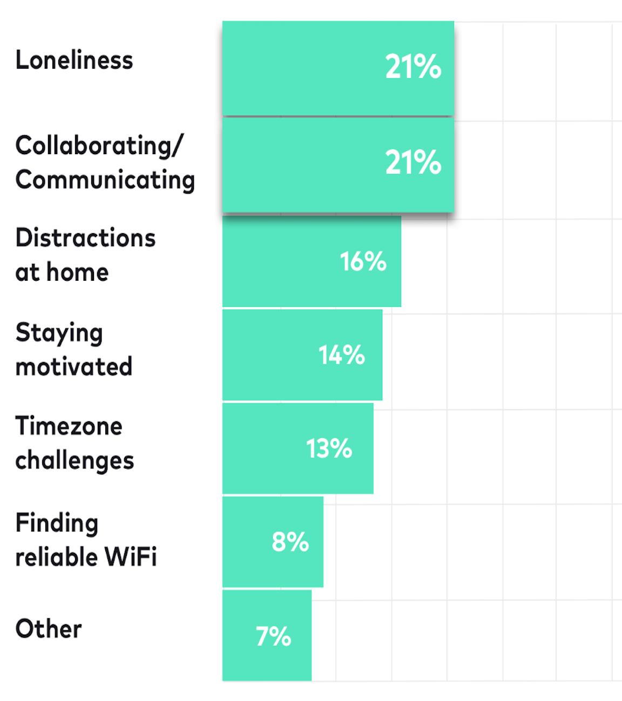
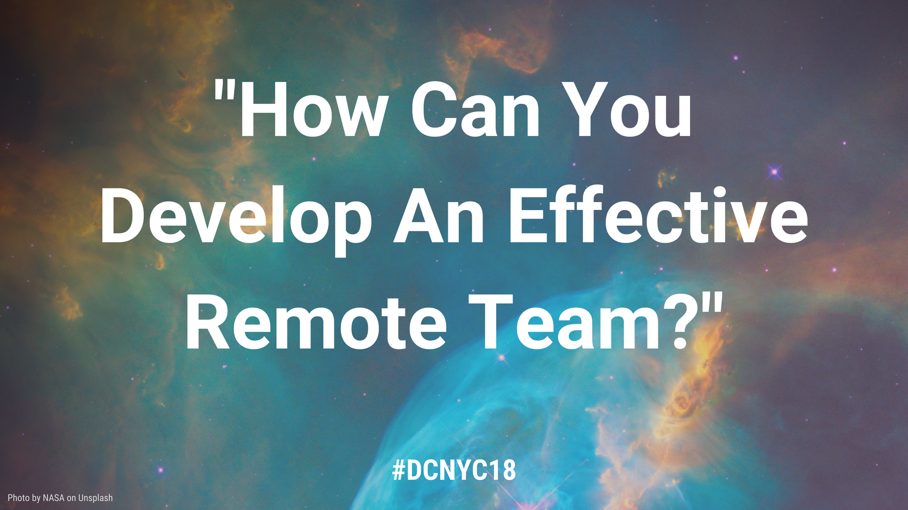
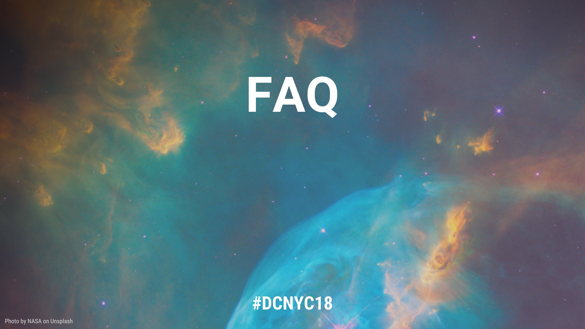
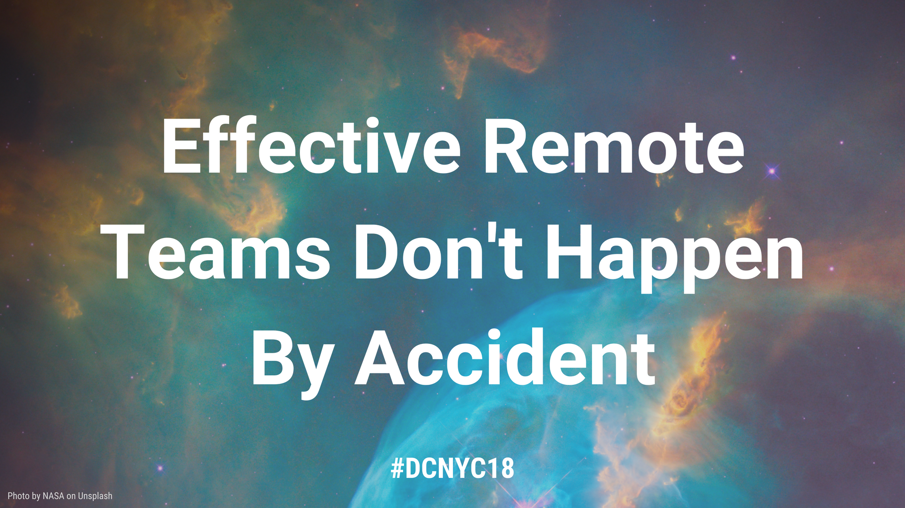

footer: @n8ebel #DCNYC18
slidenumbers: true
build-lists: true

[.slidenumbers: false]
[.hide-footer]


___

# About Me

- Android dev at Udacity
- last 2+ years fully remote
- currently based in Seattle

^ have lived/worked in California, Idaho, & Seattle

^ have used remote work to the fullest
___

# Our Team

- 75% remote
- 2 continents
- 3 countries
- 4 timezones

^ 75% of team is not at HQ

___

> remote work sounds great

___

# Increasing Popularity
- 60% companies offer telecommuting opportunities [^1]
- 37% would change jobs to work where the want [^2]
- 11.5%/year increase in fully remote programmers [^2]

[^1]: 2016 Society for Human Resource Management (SHRM) benefits survey

[^2]: Gallup - https://news.gallup.com/reports/199961/7.aspx

___

> remote success doesn't happen by accident

___

> __How can teams work effectively when spread across locations and timezones?__

___

# Working Effectively Across Spacetime
Requires:

- trust
- communication
- engagement
- proper tools

___

# Working Effectively Across Spacetime
What We'll Cover:

- benefits & challenges
- communication strategies
- team engagement
- common questions

___

> __What Is A Remote Team?__

___

# What Is A Remote Team?
- email & chat from a mobile device?
- work from home once in a while?
- one person that isn't colocated?

___

# Our Definition Of Remote?
- remote first
- spread across locations & timezones
- practices & technologies in place
- 5% increase from 2012 - 2016 [^2]

[^2]: Gallup - https://news.gallup.com/reports/199961/7.aspx

^ without it, it's not the norm and it's easy to let things slide

___

# Why The Distinction?
- differences in technology, policies, workflows
- easier to let things slide

^ home office not setup

^ bad internet
___
[.slidenumbers: false]
[.hide-footer]


___

> __The Benefits__

___



## What's the biggest benefit to working remotely? [^3]

[^3]: Buffer - State of Remote Work 2018 Report

___

# Individual Benefits: Time

- 53% say greater work/life balance "very important" [^2]
- less travel time & expense
- more time with family & friends

[^2]: Gallup - https://news.gallup.com/reports/199961/7.aspx

___

# Individual Benefits: Flexibility

- flexible hours
- flexible location
- cost of living
- new location != new job

___

# Individual Benefits: Productivity

- control over working environment
- fewer distractions -> increased flow
- 10-15% increase in productivity with less observation [^4]

[^4]: http://journals.sagepub.com/doi/abs/10.1177/0001839212453028

^ more personalized workspace

^ Harvard Business School survey

___

> **"90% of remote workers plan on working remotely for the rest of their careers" [^3]**

[^3]: Buffer - State of Remote Work 2018 Report

___

# Organization/Team Benefits
- lower costs
- larger talent pool
- diversity
- increased retention

___

# Organization/Team Benefits
- easier meetings/scheduling
- increased productivity

___

> __The Challenges__

___

# Organization: Support
- must invest in supportive technologies
- must develop clear policies & expectations
- must trust employees

___

# Organization: Hiring
- larger talent pool to screen
- screening a more diverse set of applicants
- selecting for remote-friendly traits

___

# Team: Engagement
- full team communication
- equal contribution
- team building
- timezones

___



## What's the biggest struggle with working remotely? [^3]

[^3]: Buffer - State of Remote Work 2018 Report

___

# Individual
- staying productive
- boundaries
- isolation
- no catering/snacks/perks

___
[.slidenumbers: false]
[.hide-footer]



___

> __Communication Is Key__

___

# Communication
- set expectations
- be intentional
- embrace various mediums

___

# Communication: Set Expectations
- async communication
- core hours
- define where communication happens

___

# Communication: Be Intentional
- over communicate
- document & share your work
- share questions, concerns, ideas

^ might feel like you're over communicating at first

^ be thorough in documenting requirements, questions, progress

___

# Communication: Different Mediums

- escalate when needed
- use video, emoji, images to make up for lack of non-verbal cues
- always put a face to the voice
- find a quite space for video

^ don't be afraid to move from comment to chat to video when needed

^ make sure all faces are visible during video chats

___

> __Intentional Engagement__

___

# Engagement
- must be first-party citizens
- buy in
- trust from day one

^ trust that you're employees will do their jobs

^ value output
___

# Engagement: Group Involvement
- regular sync ups & 1:1s
- encourage casual communication
- schedule time to chat as a team

___

# Engagement: Group Involvement
- make time to discuss & brainstorm in a high-bandwidth manner
- value/seek input & views from everyone
- groups > 1:1

___

# Engagement: Team Building

- team on-sites
- shared activity weeks: hackathons, tech-debt, etc
- lunch & learn, conferences, etc

___

# Engagement: Build Connections

- assume good intent
- protect 1:1 time with manager
- make yourself visible
- build relationships

^ have allies on other teams

___

> __Refined Workflows__

___

# Workflows: Planning
- diligently plan
- document & update requirements
- enable async assessment of progress

^ easy to update requirements without everyone knowing about it

^ ensure everyone is on the same page
___

# Workflows: Code & Design Review
- blend async & video review
- escalate when appropriate
- leverage available tools

___

# Workflows: Pair Programming
- still fully possible
- video chat & screen share

___

# Workflows: QA
- group video & screen share
- images & video are invaluable
- shared documents

___

> __Build Your Toolbox__

___

## Tools
- must have proper technology available
- network connection is your lifeline

___

## Tools: Chat & Video
- Slack
- Hangouts, Zoom
- Google Docs, Sheets, Forms, etc
- Vysor
- auto-add video to meetings & conference rooms

___

## Tools: Planning & Documentation
- Jira, Trello, GitHub issues
- Confluence, GitHub wiki

___

## Tools: Code & Design
- GitHub, GitLab
- InVision

___

## Tools: Secret Sharing
- LastPass, Dashlane

___

## Tools: Misc
- World Time Buddy
- Doodle
- Slack polls
- QuickTime, screenshot

___
[.slidenumbers: false]
[.hide-footer]



___

> __"Do you work in your pajamas every day?"__

___

> __"How do you manage working across timezone differences?"__

^ depends on the time difference

^ define "working hours" & embrace async communication

^ set expectation of shared responsibility

^ practice empathy, be flexible

^ embrace the difference as extra maker time

^ embrace the continuous development cycles
___

> __"How do you stay productive when not in an office?"__

^ discipline

^ build a routine.  get ready.  start/end times

^ have a dedicated work space.  home is not your work

^ boundaries

^ being focused, present

^ change venues
___

> __"Don't you get lonely working from home?"__

^ mindful of social requirements

^ casual team communication

^ social media

^ local communities

^ change venues
___

> Working Effectively Across Spacetime

___
[.slidenumbers: false]
[.hide-footer]



___

# Effective Remote Teams

- communicate intentionally
- cultivate engagement
- develop remote-first workflows

___
[.slidenumbers: false]

# Thank You

```kotlin
with("n8ebel").apply {
  Twitter
  YouTube
  .com
  Medium
  Facebook
}
```
